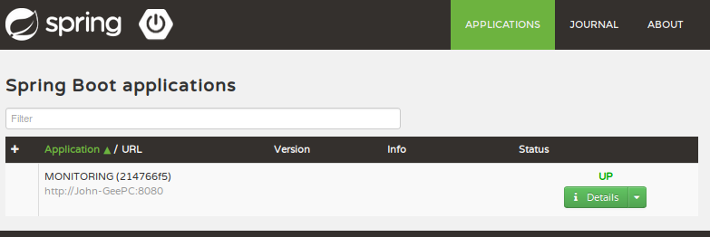
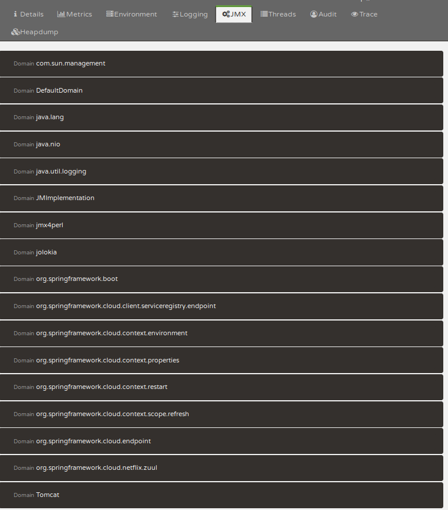

Spring Boot Admin Jolokia Issue
===============================

`src/main/resources/jolokia-access.xml` is loaded but isn't not respected.

How to reproduce
----------------

- Start eureka server via spring cloud CLI (`spring cloud eureka`)
- Run the appliaction (`./gradlew bootRun`)
- In browser, navigate to `localhost:8080`, wait for the MONITOR application
  status to appear.



- Click into the Detail button, and click into JMX button.



- Expect to see none of the MBean since we deny all of them inn the
  `jolokia-access.xml`. But all of them are available, just like when there's
  not config file.

Observation
-----------

- `jolokia-access.xml` is loaded 2 times. Note the timestamps in the below log
  snippet.


```
2017-09-30 08:39:20.117  INFO 14020 --- [  restartedMain] o.a.c.c.C.[Tomcat].[localhost].[/]       : jolokia: Using policy access restrictor classpath:/jolokia-access.xml
2017-09-30 08:39:20.263  INFO 14020 --- [  restartedMain] s.w.s.m.m.a.RequestMappingHandlerAdapter : Looking for @ControllerAdvice: org.springframework.boot.context.embedded.AnnotationConfigEmbeddedWebApplicationContext@2b9cf0fb: startup date [Sat Sep 30 08:39:18 PHT 2017]; parent: org.springframework.context.annotation.AnnotationConfigApplicationContext@2c5ea572
2017-09-30 08:39:21.138  WARN 14020 --- [  restartedMain] o.s.j.e.a.AnnotationMBeanExporter        : Bean with key 'zuulEndpoint' has been registered as an MBean but has no exposed attributes or operations
//
// Irrelevant lines are ommitted
//
2017-09-30 08:39:21.138  INFO 14020 --- [  restartedMain] o.s.j.e.a.AnnotationMBeanExporter        : Located managed bean 'configurationPropertiesRebinder': registering with JMX server as MBean [org.springframework.cloud.context.properties:name=configurationPropertiesRebinder,context=2b9cf0fb,type=ConfigurationPropertiesRebinder]
2017-09-30 08:39:21.141  INFO 14020 --- [  restartedMain] o.s.j.e.a.AnnotationMBeanExporter        : Located managed bean 'refreshEndpoint': registering with JMX server as MBean [org.springframework.cloud.endpoint:name=refreshEndpoint,type=RefreshEndpoint]
2017-09-30 08:39:21.251  INFO 14020 --- [  restartedMain] o.a.c.c.C.[Tomcat].[localhost].[/]       : jolokia: Using policy access restrictor classpath:/jolokia-access.xml
2017-09-30 08:39:21.255  INFO 14020 --- [  restartedMain] o.a.c.c.C.[Tomcat].[localhost].[/]       : jolokia: jolokia:type=Config is already registered. Adding it with jolokia:type=Config,uuid=170f55cd-f1c5-46a8-907a-e70f08ef971f, but you should revise your setup in order to either use a qualifier or ensure, that only a single agent gets registered (otherwise history functionality might not work)
2017-09-30 08:39:21.255  INFO 14020 --- [  restartedMain] o.a.c.c.C.[Tomcat].[localhost].[/]       : jolokia: Cannot register (legacy) MBean handler for config store with name jmx4perl:type=Config since it already exists. This is the case if another agent has been already started within the same JVM. The registration is skipped.
2017-09-30 08:39:21.255  INFO 14020 --- [  restartedMain] o.a.c.c.C.[Tomcat].[localhost].[/]       : jolokia: Jolokia Discovery MBean registration is skipped because there is already one registered.
```

- If we introduce error in the `jolokia-access.xml` file, for example: comment
  line 2 (`<!--<restrict>-->`) to make the invalid XML, we will got exception
  for the first load. So the first time, it actually load our config file. Not
  sure about the second time.

Related issues
--------------

- https://github.com/spring-projects/spring-boot/issues/10458
- https://github.com/codecentric/spring-boot-admin/issues/564
